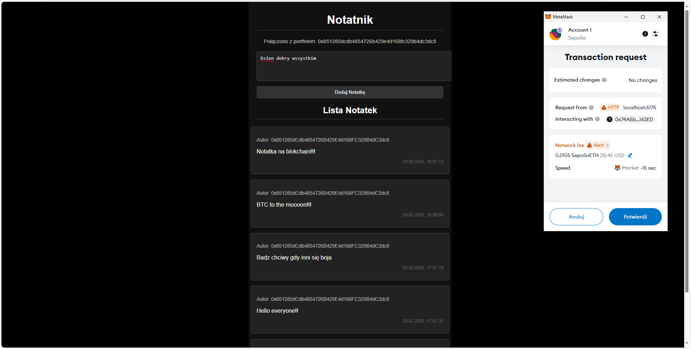

# Notatnik na Blockchainie

Aplikacja notatnika oparta na **Ethereum Blockchain** pozwala na tworzenie, przechowywanie i wyświetlanie notatek w sposób zdecentralizowany. Wszystkie notatki są zapisywane bezpośrednio w kontrakcie na blockchainie, co zapewnia ich niezmienność i bezpieczeństwo.

<div style="display: flex; justify-content: space-between;">
    
    
    
    
</div>

## Technologie:
- **Ethereum Blockchain (SepoliaETH)** – do przechowywania notatek (testowa sieć Ethereum).
- **Smart kontrakt (Solidity)** – odpowiedzialny za dodawanie i pobieranie notatek.
- **React.js** – do budowy interfejsu użytkownika.
- **MetaMask** – do połączenia z portfelem Ethereum.

## Funkcjonalności:
- **Dodawanie notatek** – użytkownicy mogą dodawać swoje notatki, które są zapisywane na blockchainie.
- **Przeglądanie notatek** – aplikacja umożliwia wyświetlanie ostatnich 5 notatek zapisanych na blockchainie.
- **Bezpieczeństwo i trwałość** – notatki są zapisane w blockchainie, co zapewnia ich nienaruszalność.

## Instalacja:
1. Zainstaluj [MetaMask](https://metamask.io/), aby połączyć się z portfelem Ethereum.
2. Skopiuj repozytorium:
   ```bash
   git clone https://github.com/twoje-repozytorium.git
   
3. Zainstaluj zależności:
   ```bash
     npm install

4. Uruchom aplikację:
   ```bash
     npm start

## Sieć:
Aplikacja korzysta z testowej sieci SepoliaETH do interakcji z kontraktem na blockchainie.

## Kontrakt:
Smart kontrakt napisany w języku Solidity jest odpowiedzialny za przechowywanie notatek i emitowanie wydarzeń.
   ```bash
   Adres kontraktu: 0x74A5b741E03782232c5f9e4629567c041FF163ED

